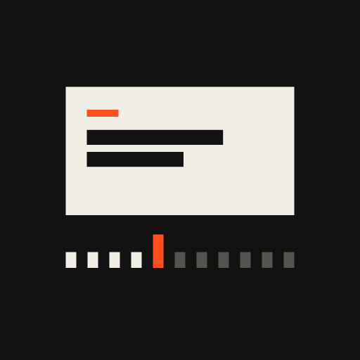
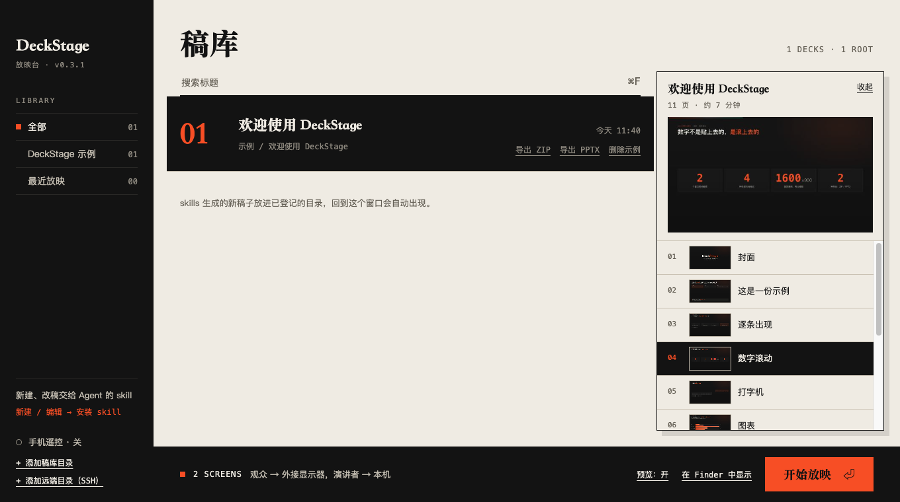
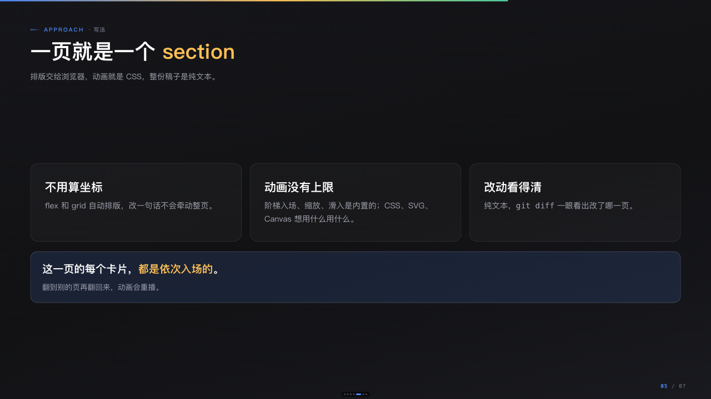
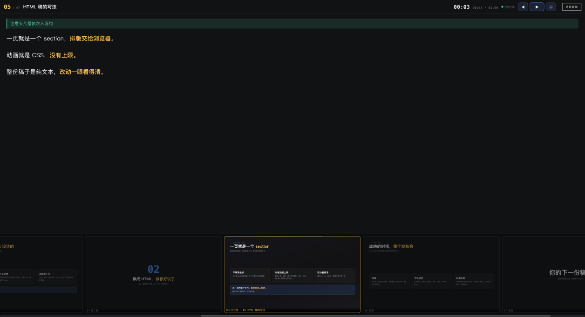
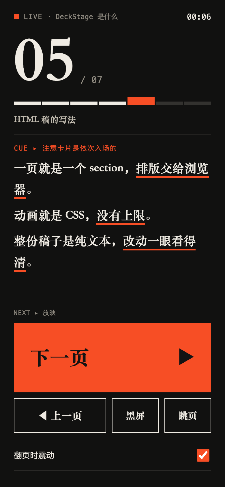

<p align="center"></p>

# DeckStage

**让 Agent 写演示稿，让放映像发布会。**

DeckStage 是一个 macOS 放映应用，配一个给 Agent 用的 skill。Agent 用 HTML 写演示稿，DeckStage 负责把它放出来：无浏览器痕迹、双屏、演讲者视图、手机遥控、投屏友好。

## 长什么样

示例稿在 [`examples/hello-deck`](examples/hello-deck)，下面的截图都来自它。

| 稿库 | 观众窗口（投出去的画面） |
|---|---|
|  |  |

| 演讲者窗口（只你看见） | 手机遥控（浏览器，免安装） |
|---|---|
|  |  |

## 为什么不用 PPT

让 Agent 做 `.pptx`，常见的体验是这样的：

| | 传统 PPT（让 Agent 生成 .pptx） | HTML 稿 + DeckStage |
|---|---|---|
| Agent 怎么写 | 通过 python-pptx、PptxGenJS 之类的库，逐个元素指定坐标、宽高、字号、颜色 | 直接写 HTML/CSS，排版交给 flex/grid，不用算坐标 |
| 一页的代码量 | 排版靠像素坐标，一页常是几十上百行布局代码，改一处间距要重算一片 | 一页就是一个 `<section>`，改哪里动哪里 |
| 看得见效果吗 | 要先渲染成图片才知道好不好看，来回迭代，每轮都花 token | 浏览器所见即所得，改完刷新即可，还有体检脚本挡掉常见错误 |
| 样式表达力 | 渐变、阴影、复杂卡片布局、图表、SVG、Canvas 要么做不了，要么很笨 | 浏览器能做的都能做，CSS 动画、SVG、Canvas、任何前端库 |
| 动画 | 几乎没法声明，Agent 基本写不出像样的 | 就是 CSS/JS，没有上限。框架还内置了阶梯入场、缩放、左滑 |
| 版本管理 | 二进制文件，diff 看不了 | 纯文本，`git diff` 一眼看懂改了哪一页 |
| 依赖 | 需要 PowerPoint / Keynote / WPS，字体和版式在不同软件里可能漂移 | 任何有浏览器的设备都能打开，不依赖办公软件 |

我们没有做过严格的 token 基准测试，上面是两种做法在原理上的差异：HTML 是 Agent 最熟悉的语言，表达力强，反馈回路短，所以更省事、更好看。

稿子最后仍然可以导出成 `.pptx`（逐页截图铺进 16:9，版式完全一致，代价是文字不可编辑），需要交付给别人时用。

## 为什么还要一个壳

HTML 稿直接用浏览器放映有几个很烦的问题，DeckStage 就是解决它们的：

- 浏览器有缓存，改了稿子看不到
- 地址栏、标签页这些多余信息会被一起投出去
- 浏览器全屏和演讲者视图冲突，接 HDMI 投屏、飞书共享屏幕时经常出问题

## 特性

- **无浏览器痕迹**：没有地址栏、标签页、工具条，鼠标 2 秒不动自动隐藏
- **双窗口**：观众窗口和演讲者窗口分开，翻页自动同步；演讲者窗口当前页放大成主画面，旁边是台词、计时、下一页预览，还有目录和激光笔
- **投屏**：插上 HDMI 自动把观众窗口全屏到外接屏；单屏开会用窗口模式，在飞书里共享这个窗口，演讲者窗口不会被拍到
- **手机遥控**：手机浏览器扫码，就能翻页、看台词、跳页、黑屏，不用装 App
- **稿库**：登记几个目录，自动扫描里面的稿子，选中回车就放；稿子在远端的 Linux / Mac 上也行，通过 SSH 登记
- **导出分享**：稿库里每份稿子一键导出 ZIP（整个目录，对方用浏览器或 DeckStage 都能放）或 PPTX（逐页截图，发给用 PowerPoint 的人）
- **不会缓存**：内置静态服务，所有响应都带 `no-store`
- **放映期间不息屏**
- **Agent 友好**：配套 skill 随应用打包，复制一段提示词给 Agent 就能装好；Agent 用 `deckstage://` 链接和应用互动

## 安装

从 [GitHub Releases](https://github.com/VangelisHaha/deck-stage/releases/latest) 下载对应安装包：

- **Android**：`DeckStage-版本-android.apk`（手机遥控 App，使用 Debug 签名，可直接侧载）
- **Windows x64**：`DeckStage-版本-win-x64.exe`
- **macOS Intel**：`DeckStage-版本-mac-x64.dmg`
- **macOS Apple Silicon**：`DeckStage-版本-mac-arm64.dmg`

桌面安装版启动后会自动检查 GitHub Release，新版本下载完成后会提示重启安装；也可以从「帮助 → 检查更新…」手动触发。当前发布包未做商业代码签名：macOS 首次打开可能需要在「系统设置 → 隐私与安全性」中确认，Windows 可能显示 SmartScreen 提示。

也可以从源码构建（Node 22+）：

```bash
git clone https://github.com/VangelisHaha/deck-stage.git
cd deck-stage
npm install
npm start
```

macOS 本地安装可运行 `npm run install-app`；开发时可以带稿子目录：`npm start -- /path/to/deck`。

## 快速开始

1. 打开 DeckStage，左下角点「新建 / 编辑 → 安装 skill」，复制安装提示词，粘贴给你的 Agent（Claude Code、Codex 等都行）
2. 对 Agent 说「做一份关于 xxx 的演示稿」，让它把稿子建在已登记的稿库目录里
3. 回到 DeckStage 选中稿子，回车放映

想先看看效果：把 `examples` 目录通过「添加稿库目录」登记进去，就能放映示例稿。

## 放映

放映中的快捷键：

| 键 | 作用 |
|---|---|
| `F` | 观众窗口 全屏 / 窗口模式 切换 |
| `D` | 观众窗口换到下一块屏幕 |
| `B` | 黑屏 |
| `P` | 聚焦演讲者窗口 |
| `Esc` | 全屏时退出全屏；窗口模式下 1.5 秒内连按两次结束放映 |
| `← →` / 翻页笔 | 翻页（两个窗口自动同步） |
| `⌘R` | 清缓存并重载 |
| `⌘W` | 结束放映，回到稿库 |

演讲者窗口右上角也有「结束放映」按钮，点一次变橙色，3 秒内再点一次才会结束，防止误触。

### 演讲者窗口

当前页是真实画面（和观众看到的是同一个），占左边大头，台词在右边，右下角是上一页和下一页的预览，临场发挥时看得清。

| 键 | 作用 |
|---|---|
| `L` | 切换布局：均衡 / 画面优先 / 台词优先；中间的分隔条也能拖，比例会记住 |
| `+` `-` | 台词字号 |
| `?` | 操作指引：完整快捷键表；窗口底部也常驻一行常用键提示 |
| `G` | 目录：顶上有搜索框，输入页码（如 `11`）、标题关键字或拼音首字母（如 `fy` → 放映）筛选，点一下或回车跳转；跳转后不会收起，`Esc` 或 ✕ 才收（目录或指引开着时 `Esc` 只收它们，不会退出全屏） |
| 数字 + 回车 | 直接跳到第几页 |
| 鼠标移入当前页 | 观众屏幕上出现一只橙色的手指着对应位置，跟着你的鼠标走 |
| `Shift` + 拖动 / `E` 后拖动 | 在观众屏幕上划线，3 秒后淡出；`C` 或翻页立即清除 |

菜单「放映」里还有「投屏到」、「文件变更自动刷新」、「导出 PPTX」。

## 导出与分享

稿库里鼠标移到某份稿子上（或选中它），右侧出现「导出 ZIP」和「导出 PPTX」：

- **导出 ZIP**：把整个稿子目录打成一个包（自动排除 `.git`、`node_modules`、`.DS_Store`），对方解压后用浏览器打开 `index.html`，或者拖进自己的 DeckStage。
- **导出 PPTX**：在后台逐页截图，铺进 16:9 的 `.pptx`，版式和放映时完全一致。页面存成 JPEG（质量 85%，2000×1125），一份 40 页的稿子大约一分钟、7MB 左右，进度会显示在那一行。代价是页面上的文字在 PowerPoint 里不可编辑。

两种导出都会先弹出保存对话框让你选位置，完成后在 Finder 里定位文件。

## 远端稿库（SSH）

稿子放在另一台机器上（比如开发机、服务器、另一台 Mac），不用手动拷：

1. 稿库左下角点「+ 添加远端目录（SSH）」，填 **主机地址、端口、用户名、密码、远端目录**。密码留空就用密钥登录；主机也可以写 `~/.ssh/config` 里的别名
2. 首次连接某台机器，会弹出它的主机指纹让你确认，选「信任并继续」才会记进 `known_hosts`，不会不声不响地信任
3. 添加时会先连一次，确认能连上、目录存在
4. 连接信息（主机、端口、用户名、加密后的密码）**保存在本机**：下次启动，远端稿库自动出现在列表里；再添加同一台机器的别的目录，点一下表单上方保存的连接就能带出，不用重输
5. 远端稿子出现在稿库里，路径行标着 `SSH` 和「已缓存 / 未同步」
6. 放映或导出时，先用 rsync 把这份稿子同步到本机缓存（只传变化的部分），然后和本地稿子完全一样；放映中按 `⌘R` 会重新同步并重载

要点：

- 复用系统的 `ssh` 和 `rsync`，`~/.ssh/config`、密钥、ssh-agent、跳板机都直接生效。密码登录通过 `SSH_ASKPASS` 递给 ssh，不出现在命令行里
- **密码怎么存的**：AES-256-GCM 加密后写进 `~/Library/Application Support/DeckStage/connections.json`（权限 600），密钥在同目录 `connections.key`。这只能防「打开文件就看到明文」和误传配置，**防不了能读你用户目录的人**；没用系统钥匙串，是因为未签名的应用每次升级都会被重新询问授权。介意的话用密钥登录，密码留空
- 同步失败时，如果本机有上次的副本，会问你要不要用旧副本放映，不会直接放弃
- 稿子里的 `deckstage.json` 后台服务同步后在本机运行，信任弹窗会标明来源主机
- 缓存在 `~/Library/Application Support/DeckStage/remote/`，从稿库里移除这个远端目录会一并清掉（保存的连接和密码不删，表单上方的连接标签里点 × 才会忘掉）
- 远端要有 `sh`、`find`，同步要有 `rsync`；Linux 和 macOS 的远端都支持

## 稿子自带的后台服务

有的稿子页面要调本机的接口，比如结尾页的「发送到群聊」按钮要请求一个本地服务。在稿子目录放一个 `deckstage.json` 声明它，放映时 DeckStage 替你启动，放映结束自动关闭：

```json
{
  "services": [
    {
      "name": "分享发送服务",
      "command": ["python3", "share/share_server.py"],
      "health": "http://127.0.0.1:8898/health"
    }
  ]
}
```

- `command` 在稿子目录下执行，环境用你的登录 shell 的环境。从 Finder 启动的应用只有最小的 `PATH`，找不到 `lark-cli`、`node` 这类命令，所以不能直接继承应用的环境。
- `health` 可选。放映前先访问一次，已经能通就认为服务在跑（比如你自己启动过），不会重复启动，结束时也不会关掉它。
- 服务的日志在 `~/Library/Application Support/DeckStage/logs/`。

**安全**：打开别人给的稿子就执行里面的命令，等于运行陌生程序。所以首次放映、或者命令和脚本内容有变化时，DeckStage 会弹窗列出要运行的命令，由你选择「允许并记住」「仅本次允许」「不启动」。只有信任稿子来源时才允许。

## 手机遥控

稿库左下角「手机遥控」（或 `⌘K`）打开面板：

1. 打开开关，面板显示二维码、6 位配对码和地址
2. 手机和电脑连同一个 Wi-Fi，用浏览器扫二维码；扫不了就打开地址，输入配对码
3. 手机上看到当前页码、标题、台词和下一页预告，可以上一页、下一页、跳页、黑屏

安全：默认关闭，退出应用即失效。每次开启重新生成令牌和配对码。每台手机有独立 cookie，可以在面板里单独「断开」，或「重置配对」让所有手机重新配对。配对码连错 5 次，该 IP 锁定 1 分钟。局域网内是明文 HTTP，只在可信 Wi-Fi 下使用。

网页能做的直接显示，网页做不了的不展示：

| 功能 | 浏览器 | App 壳 |
|---|---|---|
| 翻页、台词、跳页、黑屏、计时 | ✓ | ✓ |
| 防息屏（Wake Lock） | 支持的浏览器自动启用 | ✓ |
| 翻页震动 | 仅 Android 浏览器，不支持就不显示 | ✓ |
| 音量键翻页 | 不显示 | 规划中，见下 |

### 给 App 壳留的接口

遥控页检测到 `window.DeckStageNative.volumeKeys` 才会出现「按键映射」。原生层（Android / iOS）只需要：

- 提供 `window.DeckStageNative = { volumeKeys: true, enableVolumeKeys(on) }`
- 音量键被按下时派发 `window.dispatchEvent(new CustomEvent('deckstage:key', { detail: 'volumeUp' | 'volumeDown' }))`

映射关系（音量 + 对应上一页还是下一页）由页面自己保存。Android 前台用 `dispatchKeyEvent` 拦截，息屏需前台服务加 MediaSession；iOS 没有公开接口，只能在前台监听系统音量变化并复位。

## 稿子的识别规则

目录里有 `index.html`，并且有 `deck.config.js` 或 `notes.js`，就算一份稿子。扫描深度最多 4 层。选稿子目录或它的上一层（里面有 `slides/`）都行。

## 新建与编辑：Agent 和 skill

DeckStage 不编辑稿子，新建和修改都由 Agent 用配套的 [deck-html](skills/deck-html) skill 完成。稿库左下角会显示 skills 目录和一段「安装提示词」，复制给任意 Agent，它会：

1. 把 `deck-html` 装进自己的 skills 目录
2. 以后用它新建、修改稿子，放进已登记的稿库目录
3. 改完体检，再用 `deckstage://` 链接通知 DeckStage

### skill 里有什么

`skills/deck-html` 不只是模板，也包含新增和修改稿子的规范，别人装上就能复用：

| 内容 | 位置 |
|---|---|
| 新建、改文案、加页删页的流程；数据口径；分享前脱敏 | `references/workflow.md` |
| 页数多时按幕拆分文件，以及拆分稿的体检 | `references/split-deck.md`、`scripts/check_split.py` |
| 逐条出现、逐字打字、数字滚动；写专属动效的规则 | `references/effects.md`、`assets/optional/fx.js` |
| 用 DeckStage 放映、稿子的后台服务、服务的安全要求 | `references/deckstage.md`、`assets/optional/local_service.py` |
| 每份稿子的协作约定（给接手的 AI 看） | `assets/template/AGENTS.md`，新建稿子时自动带上 |

### Agent 互动协议

Agent 通过 macOS 的 `open` 命令和 DeckStage 对话。路径需 URL 编码。

| 链接 | 效果 |
|---|---|
| `deckstage://add-root?path=<目录>` | 登记稿库目录 |
| `deckstage://open?path=<稿子目录>` | 在稿库里选中这份稿子，不会自动放映 |
| `deckstage://open?path=<稿子目录>&play=1` | 直接放映（放映中无效）。仅在用户明确要求时使用 |
| `deckstage://skill-installed?agent=<名字>` | 回报 skill 已安装，稿库里会显示「已安装 · 名字」 |

配置文件在 `~/Library/Application Support/DeckStage/config.json`，`roots` 数组就是稿库目录，也可以直接改。

## 状态与已知限制

这是早期版本。

- 只在 macOS 13（Intel）上测试过。Apple Silicon 和更新的系统理论上可用，没验证
- Windows 适配在规划中：全屏、菜单、协议注册、字体、打包都要改
- 手机遥控只在浏览器模拟的手机视口里验证过，没在真机上测过；iOS Safari、Android Chrome 是目标
- Android App 壳目前只有脚手架（`mobile/`），音量键、连接页都还没做
- iOS 原生 App 暂时做不了：Capacitor 8 要求 Xcode 26，需要较新的 macOS
- 导出的 PPTX 是截图式的，文字不可编辑
- 远端稿库：远端是 Windows 的未测试；真正跨机器的 SSH（别的主机、跳板机）、密码登录成功的完整流程，我只在本机回环的 sshd 上验证过（本机 sshd 无法校验密码，密码只验证到「正确送达 ssh」这一步）

## 路线

- [x] 稿库、双窗口、投屏切换、快捷键、skill 联动
- [x] 手机网页遥控（局域网，扫码 / 配对码）
- [ ] Android App 壳（Capacitor，音量键翻页，锁屏可用）
- [ ] Windows 适配
- [ ] iOS App 壳
- [ ] 预编译安装包（Releases）

## 目录结构

```
src/main.js          主进程：窗口、IPC、deckstage:// 协议
src/session.js       一次放映：服务、双窗口、投屏布局、快捷键、防息屏
src/server.js        内置静态服务（127.0.0.1，no-store，Range）
src/library.js       稿库扫描
src/store.js         配置读写
src/services.js      稿子自带的后台服务（deckstage.json，首次需用户确认）
src/ssh.js           远端稿库底层：解析 SSH 地址、列出远端稿子、rsync 同步、密码（askpass）与主机指纹
src/connections.js   已保存的 SSH 连接（密码加密落盘）
src/remote-decks.js  远端稿库：扫描缓存、本机镜像目录、放映 / 导出前同步
src/export.js        导出 ZIP / PPTX（PPTX 在后台隐藏窗口里复用稿子自带的导出）
src/remote.js        手机遥控服务（0.0.0.0，SSE + POST，令牌/配对码）
src/remote/          手机遥控网页
src/skill.js         skill 位置与安装提示词
src/util.js          公共工具
src/menu.js          菜单栏
src/deck-preload.js  注入放映窗口：隐藏工具条、光标自隐、黑屏、结束放映按钮
src/renderer/        稿库界面
skills/deck-html/    配套 skill（稿子框架、模板、体检脚本）
mobile/              手机 App 壳（Capacitor，Android 脚手架）
examples/            示例稿（hello-deck）
docs/screenshots/    README 用的截图
scripts/             安装脚本、图标生成
assets/icon/         图标矢量母版与各尺寸
```

图标由 `scripts/gen-icons.js` 生成，改完几何参数运行 `npm run icons` 即可重新生成全部尺寸。

## 许可证

代码使用 [MIT](LICENSE) 许可证。

名称「DeckStage」和 `assets/icon/` 下的图标不随 MIT 授权：欢迎 fork 和修改代码，但分发修改版时请换一个名字和图标，避免和本项目混淆。

`skills/deck-html` 里随附的 [html2canvas](https://github.com/niklasvh/html2canvas) 和 [PptxGenJS](https://github.com/gitbrent/PptxGenJS) 均为 MIT 许可证。应用基于 [Electron](https://www.electronjs.org/)，手机壳基于 [Capacitor](https://capacitorjs.com/)，二维码使用 [qrcode](https://github.com/soldair/node-qrcode)。
